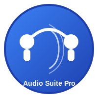

# Audio Suite Pro

> A comprehensive web-based audio transcription and text editing tool with AI-powered features.




## 🎯 Overview

Audio Suite Pro is a sophisticated web application designed for audio transcription and text processing. It leverages OpenAI's API to provide high-quality audio-to-text conversion with support for multiple languages and advanced features like speaker recognition and continuous transcription.

## ✨ Features

- **🎤 Audio Recording**: Real-time audio recording with start/stop controls
- **📝 AI Transcription**: OpenAI API integration for accurate transcription
- **🌍 Multi-language Support**: Support for German, English, French, Spanish, Chinese, and Arabic
- **👥 Speaker Recognition**: Identify different speakers in audio
- **📚 Custom Vocabulary**: Add and manage custom terminology
- **🎨 Theme Switching**: Light and dark theme options
- **💾 Audio Archive**: Store and manage audio recordings
- **🔄 Continuous Transcription**: Real-time transcription during recording
- **🎛️ Advanced Settings**: Configurable transcription parameters

## 🚀 Quick Start

### Prerequisites

- Modern web browser (Chrome, Firefox, Safari, Edge)
- OpenAI API key for transcription features
- Local web server (for development)

### Installation

1. **Clone the repository**
   ```bash
   git clone https://github.com/ChrisDCG/Lokal_neu.git
   cd Lokal_neu
   ```

2. **Install dependencies**
   ```bash
   npm install
   ```

3. **Start development server**
   ```bash
   npm run dev
   ```

4. **Open in browser**
   Navigate to `http://localhost:8000`

### Basic Usage

1. **Setup API Key**: Click the settings icon and enter your OpenAI API key
2. **Start Recording**: Click "Aufnahme starten" or press F5
3. **Stop Recording**: Click "Aufnahme stoppen" or press F5 again
4. **Upload File**: Use "Datei hochladen" to transcribe existing audio files
5. **Configure Settings**: Adjust language, temperature, and other parameters

## 🛠️ Development

### Project Structure

```
Lokal_neu/
├── src/
│   ├── js/
│   │   └── script.js          # Main JavaScript functionality
│   └── css/
│       └── style.css          # Application styles
├── assets/
│   ├── images/                # Images and logos
│   ├── audio/                 # Audio samples
│   └── icons/                 # Icon files
├── .github/
│   ├── workflows/             # GitHub Actions
│   └── ISSUE_TEMPLATE/        # Issue templates
├── tests/                     # Test files
├── index.html                 # Main HTML file
├── package.json               # Dependencies and scripts
├── README.md                  # This file
└── LICENSE                    # License information
```

### Available Scripts

- `npm run dev` - Start development server
- `npm run build` - Build for production
- `npm run test` - Run tests
- `npm run lint` - Run ESLint
- `npm run lint:css` - Run Stylelint
- `npm run lint:fix` - Fix linting issues automatically

### Technologies Used

- **Frontend**: HTML5, CSS3, JavaScript (ES6+)
- **Styling**: Tailwind CSS, Font Awesome
- **API Integration**: OpenAI Whisper API
- **Audio Processing**: Web Audio API
- **Testing**: Jest
- **Linting**: ESLint, Stylelint

## 📖 API Configuration

The application requires an OpenAI API key for transcription functionality:

1. Get your API key from [OpenAI](https://platform.openai.com/api-keys)
2. Click the settings icon in the application
3. Enter your API key in the provided field
4. Click "Speichern" to save

**Note**: API keys are stored locally in your browser and never transmitted to third parties.

## 🤝 Contributing

We welcome contributions! Please see our [Contributing Guide](CONTRIBUTING.md) for details.

### Development Setup

1. Fork the repository
2. Create a feature branch: `git checkout -b feature/amazing-feature`
3. Make your changes
4. Run tests: `npm test`
5. Commit changes: `git commit -m 'Add amazing feature'`
6. Push to branch: `git push origin feature/amazing-feature`
7. Open a Pull Request

## 📝 License

This project is licensed under the MIT License - see the [LICENSE](LICENSE) file for details.

## 🗺️ Roadmap

See our [Roadmap](ROADMAP.md) for planned features and improvements.

## 🐛 Issues & Support

- **Bug Reports**: [Create an issue](https://github.com/ChrisDCG/Lokal_neu/issues/new?template=bug_report.md)
- **Feature Requests**: [Create an issue](https://github.com/ChrisDCG/Lokal_neu/issues/new?template=feature_request.md)
- **Questions**: [Start a discussion](https://github.com/ChrisDCG/Lokal_neu/discussions)

## 🙏 Acknowledgments

- OpenAI for the powerful Whisper API
- Tailwind CSS for the styling framework
- Font Awesome for the icons
- All contributors who have helped improve this project

---

Made with ❤️ by [ChrisDCG](https://github.com/ChrisDCG)
