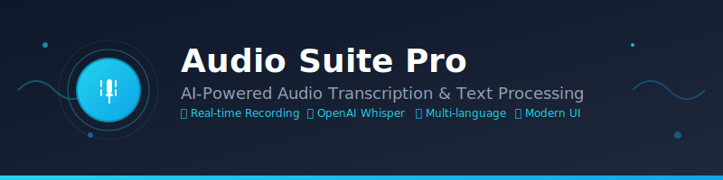

# Audio Suite Pro

<div align="center">



**A powerful, web-based audio transcription and text processing suite powered by OpenAI**

[](https://opensource.org/licenses/MIT)
[](https://chrisdcg.github.io/Lokal_neu/)
[](VERSION.md)
[](https://github.com/ChrisDCG/Lokal_neu/actions)

[Demo](https://chrisdcg.github.io/Lokal_neu/) • [Documentation](#documentation) • [Contributing](CONTRIBUTING.md) • [Roadmap](ROADMAP.md) • [API Guide](docs/API_INTEGRATION.md)

</div>

## 🎯 Overview

Audio Suite Pro is a sophisticated web application that transforms audio recordings into transcribed text using OpenAI's Whisper AI model. It offers advanced features for audio processing, text refinement, translation, and history management - all within a beautiful, responsive interface.

### ✨ Key Features

- **🎤 Real-time Audio Recording** - Record directly in your browser with visual audio feedback
- **📁 File Upload Support** - Process existing audio/video files in multiple formats
- **🧠 AI-Powered Transcription** - Leverage OpenAI Whisper for accurate speech-to-text conversion
- **👥 Speaker Recognition** - Identify and label different speakers in conversations
- **🔄 Text Refinement** - AI-powered text improvement and grammar correction
- **🌍 Multi-language Translation** - Translate transcripts to 14+ languages
- **📝 Smart Summarization** - Generate concise summaries of long transcripts
- **🗣️ Text-to-Speech** - Convert text back to speech with browser TTS
- **📚 Custom Vocabulary** - Add specialized terms for better transcription accuracy
- **🕒 Time Tracking** - Specialized mode for dictation and time logging
- **📋 History Management** - Search, filter, and manage transcription history
- **🎨 Dual Themes** - Light and dark mode support
- **🌐 Internationalization** - Support for German, English, French, Spanish, Chinese, and Arabic

## 🚀 Quick Start

### Prerequisites

- Modern web browser (Chrome, Firefox, Safari, Edge)
- OpenAI API key ([Get one here](https://platform.openai.com/api-keys))
- Microphone access for recording (optional)

### Installation

1. **Clone the repository**
   ```bash
   git clone https://github.com/ChrisDCG/Lokal_neu.git
   cd Lokal_neu
   ```

2. **Serve the application**
   ```bash
   # Option 1: Using Python
   python -m http.server 8000
   
   # Option 2: Using Node.js
   npx serve .
   
   # Option 3: Using Live Server (VS Code extension)
   # Open index.html and click "Go Live"
   ```

3. **Open in browser**
   Navigate to `http://localhost:8000` in your web browser

4. **Configure OpenAI API**
   - Click the settings gear icon
   - Enter your OpenAI API key
   - Click "Save"

### Usage

1. **Record Audio**: Click "Start Recording" or press F5 to begin recording
2. **Upload File**: Use "Upload File" button to process existing audio/video files
3. **Configure Options**: 
   - Set source language (or use auto-detect)
   - Add context/prompts for better accuracy
   - Enable speaker recognition if needed
   - Choose automatic text refinement
4. **Process**: Audio is automatically transcribed using OpenAI Whisper
5. **Enhance**: Use AI tools to refine, summarize, or translate your text
6. **Export**: Copy, email, or download your results as .txt files

## 📁 Project Structure

```
Lokal_neu/
├── src/                          # Source code
│   ├── js/
│   │   └── script.js            # Main application logic
│   ├── css/
│   │   └── style.css            # Styling and themes
│   └── index.html               # Main HTML file
├── assets/                       # Static assets
│   ├── images/                  # Images and icons
│   ├── logo.svg                 # Application logo
│   └── banner.png               # Project banner
├── .github/                      # GitHub configuration
│   ├── workflows/               # CI/CD workflows
│   ├── ISSUE_TEMPLATE/          # Issue templates
│   └── pull_request_template.md # PR template
├── tests/                        # Test files
│   ├── unit/                    # Unit tests
│   └── integration/             # Integration tests
├── docs/                         # Documentation
├── CONTRIBUTING.md               # Contribution guidelines
├── ROADMAP.md                   # Project roadmap
├── LICENSE                      # MIT License
├── package.json                 # Dependencies and scripts
└── README.md                    # This file
```

## 🛠️ Development

### Local Development Setup

1. **Install dependencies**
   ```bash
   npm install
   ```

2. **Start development server**
   ```bash
   npm run dev
   ```

3. **Run linting**
   ```bash
   npm run lint
   npm run lint:css
   ```

4. **Run tests**
   ```bash
   npm test
   ```

### Configuration

The application stores configuration in browser localStorage:
- OpenAI API key (encrypted)
- UI theme preference
- Language settings
- Transcription history
- Custom vocabulary

### API Integration

Audio Suite Pro integrates with OpenAI's API endpoints:
- **Whisper API** (`/v1/audio/transcriptions`) - Speech-to-text
- **Chat Completions API** (`/v1/chat/completions`) - Text processing, refinement, and translation

## 🔧 Configuration Options

### Audio Settings
- **Language**: Set source audio language or use auto-detection
- **Temperature**: Control transcription creativity (0-1)
- **Context/Prompt**: Provide context for better accuracy
- **Speaker Recognition**: Enable diarization for multi-speaker audio

### Processing Options
- **Continuous Transcription**: Append new transcriptions to existing text
- **Auto-Refinement**: Automatically improve transcribed text
- **Time Tracking Mode**: Specialized formatting for time logging
- **Custom Vocabulary**: Add domain-specific terms

## 🌍 Supported Languages

### Interface Languages
- 🇩🇪 German (Deutsch)
- 🇺🇸 English
- 🇫🇷 French (Français)
- 🇪🇸 Spanish (Español)
- 🇨🇳 Chinese (中文)
- 🇸🇦 Arabic (العربية)

### Transcription Languages
Supports all languages supported by OpenAI Whisper, including:
- English, German, Spanish, French, Italian, Portuguese
- Dutch, Polish, Swedish, Russian, Chinese, Japanese
- Korean, Arabic, and many more

### Translation Languages
- English (US), German, French, Spanish, Italian
- Portuguese (BR), Dutch, Polish, Swedish, Russian
- Chinese (Simplified), Japanese, Korean, Arabic

## 📱 Browser Compatibility

- ✅ Chrome 80+
- ✅ Firefox 75+
- ✅ Safari 13+
- ✅ Edge 80+

**Required APIs:**
- MediaRecorder API (for recording)
- Web Audio API (for audio visualization)
- Fetch API (for OpenAI integration)
- IndexedDB (for audio archive)

## 🔒 Privacy & Security

- **Local Processing**: All audio processing happens client-side
- **Secure Storage**: API keys are stored locally in encrypted format
- **No Data Collection**: No user data is sent to third parties except OpenAI
- **HTTPS Required**: Use HTTPS in production for microphone access

## 🤝 Contributing

We welcome contributions! Please see our [Contributing Guidelines](CONTRIBUTING.md) for details.

### Development Workflow

1. Fork the repository
2. Create a feature branch (`git checkout -b feature/amazing-feature`)
3. Make your changes
4. Run tests and linting
5. Commit your changes (`git commit -m 'Add amazing feature'`)
6. Push to the branch (`git push origin feature/amazing-feature`)
7. Open a Pull Request

## 🗺️ Roadmap

See our [detailed roadmap](ROADMAP.md) for upcoming features and improvements.

### Upcoming Features
- 📱 Progressive Web App (PWA) support
- 🔗 Integration with cloud storage services
- 📊 Advanced analytics and insights
- 🎛️ Audio editing capabilities
- 🔌 Plugin system for extensibility

## 📄 License

This project is licensed under the MIT License - see the [LICENSE](LICENSE) file for details.

## 📦 Versioning

We use [Semantic Versioning](https://semver.org/) for versioning. For the versions available, see the [VERSION.md](VERSION.md) file and the [tags on this repository](https://github.com/ChrisDCG/Lokal_neu/tags).

**Current Version:** v1.0.0

### Version History
- **v1.0.0** - Initial release with complete repository restructure and professional development setup

## 🙏 Acknowledgments

- [OpenAI](https://openai.com/) for providing the Whisper and GPT APIs
- [Tailwind CSS](https://tailwindcss.com/) for the utility-first CSS framework
- [Font Awesome](https://fontawesome.com/) for the beautiful icons
- The open-source community for inspiration and feedback

## 📞 Support

- 🐛 **Bug Reports**: [Create an issue](https://github.com/ChrisDCG/Lokal_neu/issues)
- 💡 **Feature Requests**: [Start a discussion](https://github.com/ChrisDCG/Lokal_neu/discussions)
- 📧 **Direct Contact**: Open an issue for support questions

---

<div align="center">

**Made with ❤️ by the Audio Suite Pro team**

[⬆ Back to top](#audio-suite-pro)

</div>
